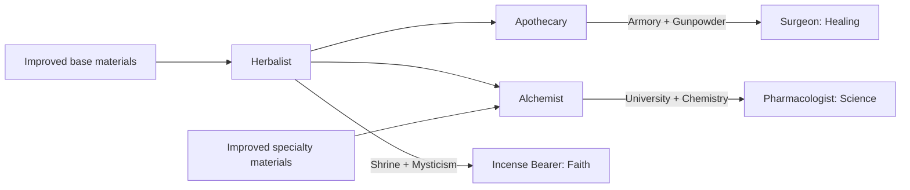

# 3. Apothecaries' Quarter

The Herbalist prepares ingredients from nearby materials. The Apothecary turns them into medicines for the city and its soldiers, while the Alchemist combines them with specialty materials for research.

| | Standard game | Mods |
|---|---|---|
| {{base}} Base Materials | Cocoa, Coffee, Honey, Incense, Olives, Spices, Tea, Tobacco | Algae (R2), Aloe (R2), Cannabis (CH), Coca (LAR), Coral (R2 / SO), Hemp (CH), Kelp (SO), Medicinal Herbs (R2), Mushrooms (R2), Poppies (R2), Sandalwood (R2), Seashells (R2), Sponge (R2), Yerba Mate (LAR) |
| {{spec}} Specialty Materials | Copper, Iron, Mercury, Silver | Gold (R2 / SR) |

* Main yield focus: {{science}} Science
* Unlocks at Craftsmanship
* Base cost: 60 {{production}} Production
* Maintenance cost: 1 {{gold}} Gold

---

* +1 {{production}} Production from each adjacent {{base}} Base or {{spec}} Specialty Materials resource from this supply chain.
* +1 {{gold}} Gold from each adjacent {{sales}} Holy Site, and +1 {{faith}} Faith in return.
* +1 {{gold}} Gold from each adjacent {{sales}} Commercial Hub, Encampment and Campus, and +1 {{science}} Science in return.
* With City Lights:
   * +1 {{production}} Production from each adjacent {{goods}} Rural Community, and +1 {{science}} Science in return.
   * +1 {{gold}} Gold from each adjacent {{sales}} Urban Borough, and +1 {{science}} Science in return.
* +1 {{production}} Production if the Quarter is built adjacent to Forest or Rainforest.

## 1. Materials

* {{base}} Base Materials improvements: +1 {{production}} Production and +1 {{gold}} Gold from each adjacent Herbalist.
   * +2 {{production}} Production and +2 {{gold}} Gold to an Industry, and +3 {{production}} Production and +3 {{gold}} Gold to a Corporation.
* {{spec}} Specialty Materials improvements: +1 {{production}} Production and +1 {{gold}} Gold from each adjacent Alchemist.
   * +2 {{production}} Production and +2 {{gold}} Gold to an Industry, and +3 {{production}} Production and +3 {{gold}} Gold to a Corporation.

## 2. Herbalist

* Unlocks at Irrigation
* Costs 80 {{production}} Production
* Maintenance: -2 {{gold}} Gold

* +1 {{science}} Science from each adjacent {{base}} Base Materials improvement.
   * +2 {{science}} Science from an Industry, and +3 {{science}} Science from a Corporation.
* +1 {{production}} Production and +1 {{gold}} Gold from the local Apothecary and Alchemist, providing +1 {{science}} Science to each in return.
* +1 {{production}} Production and +1 {{gold}} Gold from each adjacent Shrine, and +1 {{faith}} Faith in return.
* At Mysticism, a Herbalist adjacent to an improved {{base}} Base Materials resource unlocks:
   * An Incense Bearer is established in an adjacent Holy Site if it has a Shrine.
   * The Incense Bearer provides +1 {{citizen}} Citizen slot in the Holy Site. Each adjacent supplied Herbalist gives the city +10% {{faith}} Faith and +1 {{prophet}} Great Prophet point per turn.

## 3. Apothecary

* Unlocks at Guilds
* Requires a Herbalist in the Quarter
* Costs 160 {{production}} Production
* Maintenance: -2 {{gold}} Gold

* +1 {{production}} Production and +1 {{gold}} Gold to the local Herbalist, in return for +1 {{science}} Science.
* +1 {{citizen}} Citizen slot, and +2 {{science}} Science and +1 {{gold}} Gold to {{citizen}} Citizens in the Quarter.
* +1 {{amenity}} Amenity in the city.
* +0.1 {{science}} Science per {{citizen}} Citizen to the city of each adjacent Market or Armory, and +0.1 {{production}} Production and +0.1 {{gold}} Gold per {{citizen}} Citizen to the Apothecary's city in return. Each transaction uses the customer city's population.
* At Gunpowder, an Apothecary adjacent to an improved {{base}} Base Materials resource unlocks:
   * A Surgeon is established in an adjacent Encampment if it has an Armory.
   * The Surgeon provides +1 {{citizen}} Citizen slot in the Encampment. Each adjacent supplied Apothecary gives friendly units in the city territory +10 HP healing per turn and the city +1 {{general}} Great General point per turn.
* +1 {{science}} Science bonus to trade routes to the city, and +1 {{production}} Production and +1 {{gold}} Gold to the Quarter in return, if the Quarter has an adjacent improved {{base}} Base Materials resource and the origin city does not have an Apothecaries' Quarter. +1 {{amenity}} Amenity to the origin city.

## 4. Alchemist

* Unlocks at The Enlightenment
* Requires a Herbalist in the Quarter
* Costs 250 {{production}} Production
* Maintenance: -3 {{gold}} Gold

* +1 {{production}} Production and +1 {{gold}} Gold to the local Herbalist, in return for +1 {{science}} Science.
* +1 {{science}} Science from each adjacent {{spec}} Specialty Materials improvement.
   * +2 {{science}} Science from an Industry, and +3 {{science}} Science from a Corporation.
* +1 {{citizen}} Citizen slot, and +1 {{science}} Science and +2 {{gold}} Gold to {{citizen}} Citizens in the Quarter.
* +1 {{amenity}} Amenity in all cities within 6 tiles.
* +1 {{science}} Science for every 5 {{citizen}} Citizens in the city to each adjacent University, and +1 {{production}} Production and +1 {{gold}} Gold for every 5 {{citizen}} Citizens in the University's city to the Alchemist's city in return.
* At Chemistry, an Alchemist adjacent to improved {{base}} Base and {{spec}} Specialty Materials resources unlocks:
   * A Pharmacologist is established in an adjacent Campus if it has a University.
   * The Pharmacologist provides +1 {{citizen}} Citizen slot in the Campus. Each adjacent supplied Alchemist gives the city +10% {{science}} Science and +1 {{scientist}} Great Scientist point per turn.
* +1 {{science}} Science bonus to trade routes to the city, and +1 {{production}} Production and +1 {{gold}} Gold to the Quarter in return, if the Quarter has adjacent improved {{base}} Base and {{spec}} Specialty Materials resources and the origin city does not have an Apothecaries' Quarter. +1 {{amenity}} Amenity to the origin city.
